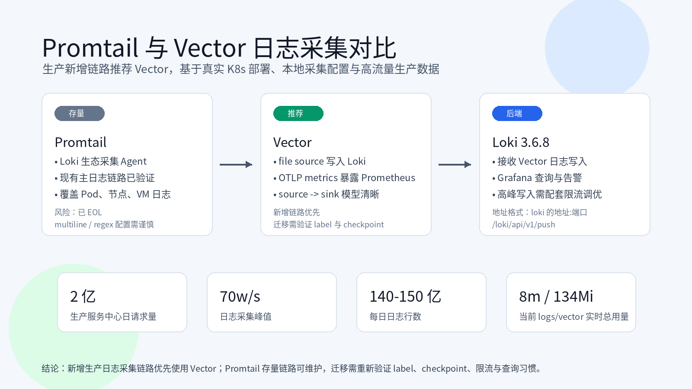

# 日志采集端组件：Promtail 与 Vector 的生产使用总结



日志采集链路通常包含三部分：

```text
采集端 -> 集中存储和查询服务 -> 展示 UI 服务
Promtail / Vector -> Loki -> Grafana
```

这篇文档主要讨论采集端组件的使用，重点是 Promtail 和 Vector。日志采集端还有 Filebeat、Logstash、Alloy 等其他选择，但本文只基于当前生产环境实际使用过的 Promtail 和 Vector 展开。

我们选择采集端组件时，重点关注以下几个方面：

1. 兼容主流中间件：支持投递到 Kafka、Loki 等常见组件，方便后续替换或扩展方案。
2. 资源消耗低：当前生产环境中 Promtail 实例已经部署 `802+` 个。如果单实例内存消耗从 `50MB` 增加到 `200MB`，整体内存消耗就会从约 `39GB` 增加到约 `156GB`，差距接近 4 倍。
3. 具备日志处理能力：支持过滤、监控、转换、字段提取、敏感内容脱敏等处理。

我们的需求是：

1. 采集所有 Kubernetes Pod 输出到控制台的日志。
2. 采集 Kubernetes 节点上的系统日志。
3. 采集 VM 上业务服务输出的日志文件。
4. 从日志中提取指标，并通过 Prometheus / Alertmanager 做告警。
5. 采集 Kubernetes Event，方便排查集群资源变更、调度和异常事件。

## 1. Promtail 处理 5 个需求的方式

Promtail 是 Loki 生态里的日志采集 Agent，主要负责读取文件日志、给日志打 label，然后通过 Loki HTTP API 推送到 Loki。当前采用的官方镜像审核版本是 `docker.io/grafana/promtail:2.8.2`。

### 1.1 需求 1、2：采集 Kubernetes Pod 控制台日志和节点系统日志

Promtail 可以以 DaemonSet 方式运行在每个 Kubernetes 节点上，直接读取节点上的 `/var/log/pods` 和 `/var/log`。下面的 ConfigMap 同时包含 Pod 控制台日志和节点系统日志采集配置。

```yaml
apiVersion: v1
kind: ConfigMap
metadata:
  name: promtail-config
  namespace: logs
data:
  promtail.yaml: |
    server:
      http_listen_port: 9080
      grpc_listen_port: 0
      enable_runtime_reload: true

    clients:
      - url: http://loki的地址:端口/loki/api/v1/push

    positions:
      filename: /run/promtail/positions.yaml

    scrape_configs:
      - job_name: kubernetes-pods
        static_configs:
          - targets:
              - localhost
            labels:
              job: kubernetes-pods
              type: pod
              __path__: /var/log/pods/*/*/*.log

      - job_name: node-system-log
        static_configs:
          - targets:
              - localhost
            labels:
              job: node-system-log
              type: system
              __path__: /var/log/messages
          - targets:
              - localhost
            labels:
              job: node-system-log
              type: system
              __path__: /var/log/syslog
```

对应 DaemonSet：

```yaml
apiVersion: apps/v1
kind: DaemonSet
metadata:
  name: promtail
  namespace: logs
  labels:
    app: promtail
spec:
  selector:
    matchLabels:
      app: promtail
  template:
    metadata:
      labels:
        app: promtail
    spec:
      tolerations:
        - operator: Exists
      containers:
        - name: promtail
          image: docker.io/grafana/promtail:2.8.2
          imagePullPolicy: IfNotPresent
          args:
            - -config.file=/etc/promtail/promtail.yaml
            - -config.expand-env=true
          ports:
            - name: http-metrics
              containerPort: 9080
              protocol: TCP
          resources:
            requests:
              cpu: 10m
              memory: 50Mi
            limits:
              cpu: "1"
              memory: 100Mi
          volumeMounts:
            - name: config
              mountPath: /etc/promtail
              readOnly: true
            - name: run
              mountPath: /run/promtail
            - name: pods
              mountPath: /var/log/pods
              readOnly: true
            - name: containers
              mountPath: /var/log/containers
              readOnly: true
            - name: varlog
              mountPath: /var/log
              readOnly: true
      volumes:
        - name: config
          configMap:
            name: promtail-config
        - name: run
          hostPath:
            path: /run/promtail
            type: DirectoryOrCreate
        - name: pods
          hostPath:
            path: /var/log/pods
        - name: containers
          hostPath:
            path: /var/log/containers
        - name: varlog
          hostPath:
            path: /var/log
```

### 1.2 需求 3：采集 VM 服务日志

VM 场景可以直接运行 Promtail 二进制进程。部署目录建议如下：

```text
/opt/promtail/
  promtail-linux-amd64
  config.yaml
  positions.yaml
```

配置示例：

```yaml
server:
  http_listen_port: 9080
  grpc_listen_port: 0
  enable_runtime_reload: true

clients:
  - url: http://loki的地址:端口/loki/api/v1/push

positions:
  filename: /opt/promtail/positions.yaml

scrape_configs:
  - job_name: vm-app-log
    static_configs:
      - targets:
          - localhost
        labels:
          job: vm-app-log
          type: app
          node: ${HOSTNAME}
          app: order-service
          __path__: /data/apps/order-service/logs/**/*.log
```

终端直接启动方式：

```bash
cd /opt/promtail
export HOSTNAME="$(hostname)"
./promtail-linux-amd64 -config.file=./config.yaml -config.expand-env=true
```

### 1.3 需求 4：从日志中提取指标并告警

Promtail 可以通过 `pipeline_stages.metrics` 从日志内容中提取指标，再暴露给 Prometheus 抓取，最后由 Prometheus / Alertmanager 完成告警。

典型流程：

```text
日志 -> pipeline regex -> metrics counter -> Prometheus scrape -> Alertmanager
```

示例配置：

```yaml
server:
  http_listen_port: 9080
  grpc_listen_port: 0

clients:
  - url: http://loki的地址:端口/loki/api/v1/push

positions:
  filename: /run/promtail/positions.yaml

scrape_configs:
  - job_name: app-log-alert
    static_configs:
      - targets:
          - localhost
        labels:
          job: app-log-alert
          app: alert-service
          __path__: /var/log/pods/*/*/*.log
    pipeline_stages:
      - match:
          selector: '{app="alert-service"}'
          stages:
            - regex:
                expression: "^.*(?P<sync_region_location_code>WARN sync_region - location code ).*$"
            - metrics:
                sync_region_location_code_total:
                  type: Counter
                  description: "sync_region_location_code_total"
                  prefix: log_service_
                  source: sync_region_location_code
                  max_idle_duration: 24h
                  config:
                    action: inc
```

Prometheus 可以按时间窗口增量做告警：

```promql
delta(log_service_sync_region_location_code_total[1h]) > 1000
```

这类日志告警适合捕捉业务异常关键字，但不适合替代标准业务指标。regex 要尽量精确，指标 label 也要控制数量，不要把 request_id、手机号、订单号这类高基数字段做成 label。

### 1.4 需求 5：采集 Kubernetes Event

Promtail 不直接从 Kubernetes API 读取 Event。实际方案是先由 `kubernetes-event-exporter` 把 Event 输出为标准输出 JSON，再由 Promtail 按普通 Pod 控制台日志采集。

```yaml
apiVersion: v1
kind: ConfigMap
metadata:
  name: event-exporter-cfg
  namespace: monitoring
data:
  config.yaml: |
    logLevel: error
    logFormat: json
    route:
      routes:
        - match:
            - receiver: dump
    receivers:
      - name: dump
        stdout: {}
```

```yaml
apiVersion: apps/v1
kind: Deployment
metadata:
  name: event-exporter
  namespace: monitoring
  labels:
    app: event-exporter
    version: v1
spec:
  replicas: 1
  revisionHistoryLimit: 10
  selector:
    matchLabels:
      app: event-exporter
      version: v1
  strategy:
    type: RollingUpdate
    rollingUpdate:
      maxSurge: 25%
      maxUnavailable: 25%
  template:
    metadata:
      labels:
        app: event-exporter
        version: v1
    spec:
      containers:
        - name: event-exporter
          image: ghcr.io/opsgenie/kubernetes-event-exporter:v0.11
          imagePullPolicy: Always
          args:
            - -conf=/data/config.yaml
          resources:
            requests:
              cpu: 10m
              memory: 10Mi
            limits:
              cpu: 50m
              memory: 20Mi
          volumeMounts:
            - name: cfg
              mountPath: /data
              readOnly: true
      volumes:
        - name: cfg
          configMap:
            name: event-exporter-cfg
```

## 2. Vector 当前真实部署配置

Vector 是一个通用可观测性数据管道，采用 `sources -> transforms -> sinks` 模型。下面只记录当前能看到的真实配置：一套来自 Kubernetes `logs` 命名空间中的 `vector` 资源，一套来自本地 `/media/liuxu/data/component/vector/file.yaml` 的文件日志采集配置。

当前真实部署信息：

| 项目 | 值 |
| --- | --- |
| 命名空间 | `logs` |
| 工作负载 | `DaemonSet/vector` |
| Pod 数量 | `8/8 Running` |
| ConfigMap | `vector` |
| Service | `vector`、`vector-headless` |
| Helm Chart | `vector-0.51.0` |
| Vector 版本 | `0.54.0-debian` |
| 文档镜像地址 | `docker.io/timberio/vector:0.54.0-debian` |

说明：真实集群中镜像来自内部镜像仓库，文档中镜像地址按要求统一写成 Docker Hub 地址。当前这套 Vector 配置不是 Pod 日志采集到 Loki 的链路，而是接收 OpenTelemetry 数据，并把 metrics 暴露给 Prometheus 抓取。

### 2.1 Kubernetes ConfigMap

```yaml
apiVersion: v1
kind: ConfigMap
metadata:
  name: vector
  namespace: logs
  labels:
    app.kubernetes.io/component: Agent
    app.kubernetes.io/instance: vector
    app.kubernetes.io/managed-by: Helm
    app.kubernetes.io/name: vector
    app.kubernetes.io/version: 0.54.0-debian
    helm.sh/chart: vector-0.51.0
data:
  vector.yaml: |
    api:
      address: 127.0.0.1:8686
      enabled: true
      playground: false
    data_dir: /vector-data-dir
    sinks:
      prometheus_exporter:
        address: 0.0.0.0:9598
        inputs:
        - otlp.metrics
        type: prometheus_exporter
    sources:
      otlp:
        grpc:
          address: 0.0.0.0:4317
        http:
          address: 0.0.0.0:4318
          headers: []
          keepalive:
            max_connection_age_jitter_factor: 0.1
            max_connection_age_secs: 300
        type: opentelemetry
```

这段配置表示：

1. Vector API 监听 `127.0.0.1:8686`。
2. Vector 接收 OTLP gRPC `0.0.0.0:4317` 和 OTLP HTTP `0.0.0.0:4318`。
3. `prometheus_exporter` 从 `otlp.metrics` 读取指标，并在 `0.0.0.0:9598` 暴露给 Prometheus。
4. 当前配置里没有 `file`、`kubernetes_logs`、`loki` sink，所以它不是当前日志写入 Loki 的主链路。

### 2.2 Kubernetes DaemonSet

```yaml
apiVersion: apps/v1
kind: DaemonSet
metadata:
  name: vector
  namespace: logs
  labels:
    app.kubernetes.io/component: Agent
    app.kubernetes.io/instance: vector
    app.kubernetes.io/managed-by: Helm
    app.kubernetes.io/name: vector
    app.kubernetes.io/version: 0.54.0-debian
    helm.sh/chart: vector-0.51.0
spec:
  selector:
    matchLabels:
      app.kubernetes.io/component: Agent
      app.kubernetes.io/instance: vector
      app.kubernetes.io/name: vector
  template:
    metadata:
      labels:
        app.kubernetes.io/component: Agent
        app.kubernetes.io/instance: vector
        app.kubernetes.io/name: vector
        vector.dev/exclude: "true"
    spec:
      containers:
        - name: vector
          image: docker.io/timberio/vector:0.54.0-debian
          imagePullPolicy: IfNotPresent
          args:
            - --config-dir
            - /etc/vector/
          env:
            - name: VECTOR_LOG
              value: info
            - name: VECTOR_SELF_NODE_NAME
              valueFrom:
                fieldRef:
                  fieldPath: spec.nodeName
            - name: VECTOR_SELF_POD_NAME
              valueFrom:
                fieldRef:
                  fieldPath: metadata.name
            - name: VECTOR_SELF_POD_NAMESPACE
              valueFrom:
                fieldRef:
                  fieldPath: metadata.namespace
            - name: PROCFS_ROOT
              value: /host/proc
            - name: SYSFS_ROOT
              value: /host/sys
          ports:
            - name: api
              containerPort: 8686
              protocol: TCP
            - name: prometheus-expo
              containerPort: 9598
              protocol: TCP
          resources:
            requests:
              cpu: 10m
              memory: 10Mi
            limits:
              cpu: 1000m
              memory: 20Mi
          volumeMounts:
            - name: data
              mountPath: /vector-data-dir
            - name: config
              mountPath: /etc/vector/
              readOnly: true
            - name: var-log
              mountPath: /var/log/
              readOnly: true
            - name: var-lib
              mountPath: /var/lib
              readOnly: true
            - name: procfs
              mountPath: /host/proc
              readOnly: true
            - name: sysfs
              mountPath: /host/sys
              readOnly: true
      volumes:
        - name: config
          projected:
            sources:
              - configMap:
                  name: vector
        - name: data
          hostPath:
            path: /var/lib/vector
        - name: var-log
          hostPath:
            path: /var/log/
        - name: var-lib
          hostPath:
            path: /var/lib/
        - name: procfs
          hostPath:
            path: /proc
        - name: sysfs
          hostPath:
            path: /sys
```

本地部署时可以给 Vector DaemonSet 增加资源限制：CPU request `10m`、limit `1000m`，内存 request `10Mi`、limit `20Mi`。内存使用 `Mi` 作为 Kubernetes memory 单位，避免和 CPU 的 `m` 混用。

### 2.3 Kubernetes Service

```yaml
apiVersion: v1
kind: Service
metadata:
  name: vector
  namespace: logs
  labels:
    app.kubernetes.io/component: Agent
    app.kubernetes.io/instance: vector
    app.kubernetes.io/managed-by: Helm
    app.kubernetes.io/name: vector
    app.kubernetes.io/version: 0.54.0-debian
    helm.sh/chart: vector-0.51.0
spec:
  type: ClusterIP
  selector:
    app.kubernetes.io/component: Agent
    app.kubernetes.io/instance: vector
    app.kubernetes.io/name: vector
  ports:
    - name: api
      port: 8686
      targetPort: 8686
      protocol: TCP
    - name: prometheus-exporter
      port: 9598
      targetPort: 9598
      protocol: TCP
```

真实集群中还存在同 selector 的 `vector-headless` Service，端口同样是 `8686` 和 `9598`，区别是 `clusterIP: None`。

### 2.4 本地文件日志采集配置

本地 `/media/liuxu/data/component/vector` 目录中有一套 Vector 文件日志采集例子，实际使用配置是 `file.yaml`。安装包里的 `vector/config/vector.yaml` 是 Vector 默认 demo 配置，内容是 `demo_logs -> remap -> console`，不作为本文配置依据。

```yaml
data_dir: /media/liuxu/data/component/vector/data_dir
sources:
  cce_logs:
    type: file
    include:
      - /media/liuxu/data/component/vector/logs/**/*.log
sinks:
  cce_loki:
    type: loki
    inputs:
      - cce_logs
    endpoint: http://loki的地址:端口
    encoding:
      codec: json
    batch:
      max_bytes: 2097152
      timeout_secs: 10
    labels:
      app: cce
      env: dev
```

这套本地配置说明：

1. `data_dir` 使用 `/media/liuxu/data/component/vector/data_dir` 保存 checkpoint 等运行状态。
2. `sources.cce_logs` 使用 `file` source 读取 `/media/liuxu/data/component/vector/logs/**/*.log`。
3. `sinks.cce_loki` 使用 `loki` sink，把日志写入 Loki。
4. Loki 地址在真实配置中是一个具体域名和端口，文档中统一写成 `http://loki的地址:端口`。
5. 批量发送限制为 `max_bytes: 2097152`，发送等待时间为 `timeout_secs: 10`。
6. 写入 Loki 的固定 label 是 `app: cce` 和 `env: dev`。

## 3. Promtail 与 Vector 的不同点和优缺点

### 3.1 当前生产角色不同

当前 `logs` 命名空间中，Promtail 和 Vector 都以 DaemonSet 方式运行：

| 组件 | 运行方式 | 副本数 | 当前用途 |
| --- | --- | --- | --- |
| `promtail-daemonset` | DaemonSet | `13` | 采集 Pod 日志和节点系统日志 |
| `vector` | DaemonSet | `8` | 当前接收指标并暴露 Prometheus metrics，也可用于日志转指标 |

当前 `kubectl -n logs top pods -l app.kubernetes.io/name=vector --containers` 的观测结果如下。注意这组 Vector Pod 是修改资源限制后刚滚动出来的新 Pod，只代表当前实时状态，不等同于长期峰值。

| 组件 | Pod 数 | CPU min / avg / max | CPU total | Memory min / avg / max | Memory total |
| --- | --- | --- | --- | --- | --- |
| Vector | `8` | `1m / 1m / 1m` | `8m` | `12Mi / 16.75Mi / 19Mi` | `134Mi` |

这里不能直接得出“Vector 一定比 Promtail 更省资源”的结论。原因是两者当前承担的工作不同：

- Promtail 当前在真实采集 Pod 日志和节点日志。
- Vector 当前主要承担指标暴露相关工作，没有承载 Pod 日志主链路采集压力。

这组数据只能说明：在当前环境中，Promtail 是日志采集主链路，资源消耗和节点日志量强相关；Vector 当前链路较轻，资源消耗明显更低。

### 3.2 历史生产问题：Promtail 内存失控

内部生产调整记录里出现过 Promtail DaemonSet 内存占用过高的问题。当时的原因不是 Promtail 必然高内存，而是配置存在两个风险：

1. `multiline` 规则不适合当前业务日志格式，导致多行日志被错误合并成一行。
2. DaemonSet 没有设置资源 limit，部分节点上的 Promtail 占用到 `2-3GB`，个别甚至更高。

后续处理方式是：

```yaml
resources:
  requests:
    memory: 50Mi
    cpu: 10m
  limits:
    memory: 500Mi
    cpu: 1000m
```

并且去掉不合适的 multiline 配置，避免最多 `128` 行日志被合并成一条超大日志。

这个案例说明：采集端资源消耗不只取决于组件本身，也取决于日志格式、pipeline、是否有 multiline、是否做 regex、是否生成 metrics、是否设置资源上限。

### 3.3 核心差异

| 维度 | Promtail | Vector |
| --- | --- | --- |
| 定位 | Loki 生态日志采集 Agent | 通用可观测性数据管道 |
| Loki 集成 | 原生面向 Loki，配置简单 | 本地真实配置通过 `loki` sink 写入 Loki |
| Kubernetes Pod 日志 | 当前真实主链路 | 当前 K8s Vector 配置未承载 Pod 日志采集 |
| VM / 本地文件日志 | 支持，配置简单 | 本地真实配置使用 `file` source 采集日志 |
| 日志指标告警 | 支持通过 `metrics` stage 从日志生成指标 | 当前 K8s Vector 配置是 OTLP metrics 转 Prometheus exporter |
| 数据处理能力 | 当前生产配置使用 pipeline stages | 当前真实配置没有使用 transform，不评价复杂处理能力 |
| 多目的地输出 | 当前主链路写 Loki | 当前 K8s 配置暴露 Prometheus metrics，本地配置写 Loki |
| 指标暴露 | Promtail 自身 metrics，也可通过 `metrics` stage 从日志生成指标 | 当前 K8s 配置通过 `prometheus_exporter` 暴露 metrics |
| 生命周期 | 已 EOL，适合维护存量 | 本文只记录当前真实使用配置，不评价生命周期 |
| 当前生产定位 | 主日志采集链路 | 当前不是日志主链路，K8s 侧用于 OTLP metrics，本地例子用于文件日志写 Loki |

### 3.4 Promtail 对比 Vector 优缺点介绍

Promtail 的优势在于现有生产链路已经验证过，和 Loki 集成直接，Kubernetes Pod 日志、节点日志、VM 文件日志都能覆盖，Grafana 查询、label 设计、告警规则也已经围绕它形成了使用习惯。缺点是 Promtail 已进入 EOL，后续新功能不会继续发展；同时 multiline、regex、labelmap 配置不当时，容易造成内存升高、单条日志过大或 Loki stream 数量膨胀。

Vector 的优势不只来自本地验证。除了当前 K8s 真实配置已经用于接收 OTLP metrics 并通过 Prometheus exporter 暴露、本地真实配置已经验证 `file` source 采集本地日志并写入 Loki 之外，另一个生产集群的服务中心也已经使用 Vector 支撑真实高流量日志采集。该服务中心每天大约 `2亿次请求`，日志采集峰值约 `70w 行/s`，每天约 `140亿-150亿行日志`，后端配合 Loki `3.6.8` 版本使用。

这说明 Vector 已经有高流量生产场景验证，不只是线下测试。它的 `source -> sink` 模型比较清晰，批量参数可以直接在 sink 中控制，例如当前本地配置中的 `max_bytes` 和 `timeout_secs`。需要注意的是，当前 `logs/vector` 这个集群配置没有承载 Pod 日志主链路，不能直接用这个集群的资源占用推导日志采集能力；本地配置也只有固定 label，没有 Kubernetes 场景下的 namespace、pod、container 等标签设计。

如果迁移 Promtail 主链路到 Vector，必须重新验证 label、checkpoint、丢包重试、限流处理和查询习惯。当前文档没有使用官网示例配置推导生产方案，未被真实配置覆盖的能力需要单独测试后再写。

### 3.5 使用取舍

生产上的建议是优先推荐 Vector：

1. 新增日志采集链路优先使用 Vector，它已经在另一个生产集群服务中心支撑每天约 `140亿-150亿行日志`、峰值约 `70w 行/s` 的采集规模。
2. 本地文件日志采集可以参考 `/media/liuxu/data/component/vector/file.yaml` 这种真实配置。
3. K8s 场景可以沿用当前 `logs/vector` 的 Helm DaemonSet 部署方式，再基于真实日志采集需求补充对应 source、sink 和 label。
4. 存量 Promtail 链路可以继续维护，但后续新增和迁移方向推荐统一到 Vector。
5. 从 Promtail 迁移到 Vector 时，不要只替换镜像，要基于真实 K8s 配置重新验证 label、positions/checkpoint、丢包重试、Loki 限流、查询习惯和告警规则。
