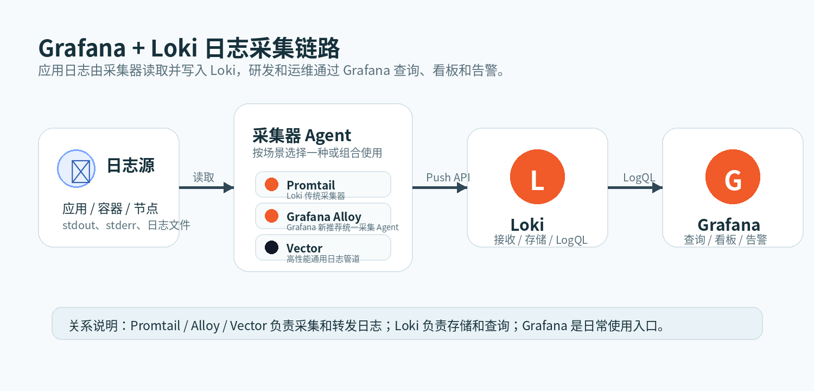

# 可观测性入门：从 Logs 到 Grafana、Loki、Promtail 最小闭环

在生产系统里，服务能跑起来只是第一步。真正上线之后，我们更关心的是：系统是否健康、接口为什么变慢、某个请求为什么失败、异常到底发生在哪个服务里。

随着微服务、容器化和 Kubernetes 的流行，一个业务请求可能会经过网关、鉴权服务、业务服务、缓存、数据库、消息队列等多个组件。服务拆得越细，日志也越分散：一部分在应用容器里，一部分在中间件里，一部分在平台组件里。如果还依赖登录机器、进入容器、手动 `grep` 日志，排查问题的时间会被大量浪费在“找日志”上。

这就是我们要搭建可观测性体系的原因。

本文先简单介绍什么是可观测性，再顺势引入 logs 这个方向。后面会围绕一条最小可运行链路展开：Grafana 负责展示，Loki 负责日志存储和查询，Promtail 作为 Agent 负责采集并投递日志。

这篇文章的目标是把 `Agent -> Loki -> Grafana` 的入门闭环跑通。生产化部署、高可用、Kubernetes DaemonSet、Grafana Alloy、告警规则、日志脱敏、性能调优等内容，会放到后续文档里逐个展开。

下面这张图先描述日志链路中几个核心组件的关系：



按照 Loki 官方 overview 的描述，一个典型的 Loki 日志栈由三类组件组成：

| 组件 | 作用 |
| --- | --- |
| Agent | 例如 Grafana Alloy、Promtail、Vector。Agent 负责抓取日志，为日志添加 labels，把日志组织成 streams，然后通过 HTTP API 推送给 Loki。 |
| Loki | 日志系统的核心服务，负责接收日志、存储日志，并处理查询请求。Loki 可以用单体、读写分离、微服务三种模式部署。 |
| Grafana | 日志查询和展示入口。用户通常在 Grafana 中使用 Explore、Dashboard 和 Alerting，也可以通过 LogCLI 或 Loki API 直接查询。 |

所以这套链路可以理解为：`Agent 采集和打标签 -> Loki 存储和查询 -> Grafana 展示和告警`。

## 1. 什么是可观测性

可观测性，简单来说，就是系统通过外部输出的信号，让我们理解内部运行状态的能力。

传统监控通常回答“系统有没有问题”，例如：

- CPU 是否过高
- 内存是否不足
- 接口错误率是否升高
- 服务是否存活

可观测性更进一步，它要帮助我们回答“为什么有问题”：

- 哪个服务最先出现异常
- 一次请求经过了哪些服务
- 慢请求卡在哪个依赖上
- 错误日志里有没有明确异常堆栈
- 最近一次发布是否导致错误率升高
- 性能瓶颈是 CPU、内存、锁竞争，还是外部依赖

在单体应用时代，日志通常集中在几台机器上，问题定位相对直接。但在微服务和 Kubernetes 场景下，一个系统可能有几十个服务、几百个 Pod、多个命名空间，实例还会动态扩缩容。日志如果没有统一采集，就会带来几个直接问题：

- 日志分散在不同节点和容器中，排查入口不统一
- Pod 重启后，本地日志可能丢失
- 多服务链路排查需要反复切换机器和容器
- 不同团队日志格式不一致，检索困难
- 生产故障时，大量时间消耗在定位日志位置上

所以，可观测性平台的核心价值，就是把系统运行时产生的信号集中起来，提供统一的采集、存储、查询、分析和告警能力。

## 2. 可观测性的几个方向

业界通常会把可观测性拆成四个方向：

| 方向 | 关注点 | 常见组件 |
| --- | --- | --- |
| 日志 Logs | 记录离散事件、异常堆栈、业务上下文 | Loki、Elasticsearch、OpenSearch、ClickHouse、Fluent Bit、Vector、Grafana Alloy |
| 监控 Metrics | 记录指标趋势和聚合状态 | Prometheus、VictoriaMetrics、Thanos、Mimir、Grafana |
| 链路追踪 Traces | 记录一次请求经过的完整调用链 | Jaeger、Zipkin、Tempo、SkyWalking、OpenTelemetry |
| 持续剖析 Profiling | 分析 CPU、内存、锁、运行时热点 | Pyroscope、Parca、Grafana Phlare、async-profiler、pprof |

这几个方向通常不是互相替代，而是互相补充：

1. 监控发现系统异常，比如错误率升高。
2. 链路追踪定位异常发生在哪个服务或依赖上。
3. 日志查看具体错误原因、参数和异常堆栈。
4. 持续剖析分析 CPU、内存、锁竞争等性能瓶颈。

本文先讨论日志这块。原因很直接：日志是研发排查问题时最常用的数据，也是可观测性体系里最容易被业务团队感知的一层。

## 3. 日志领域常见方案

日志系统一般包含四个环节：

```text
日志产生 -> 日志采集 -> 日志存储 -> 日志查询/告警
```

常见方案可以分成几类。

### 3.1 ELK / EFK

ELK 通常指 Elasticsearch、Logstash、Kibana。EFK 则是把 Logstash 换成 Fluentd 或 Fluent Bit。

优点：

- 生态成熟，资料多
- Kibana 查询和可视化能力强
- Elasticsearch 支持全文索引，适合复杂检索
- 适合需要对日志正文做大量搜索的场景

缺点：

- 资源消耗较高，尤其是索引和存储成本
- 大规模集群维护复杂
- 日志量很大时，冷热分层、索引生命周期、分片规划都需要认真设计
- 如果只是按标签和时间范围查日志，全文索引能力可能显得过重

适用场景：

- 需要强全文检索
- 需要复杂字段查询
- 已经有成熟 Elasticsearch 运维体系

### 3.2 OpenSearch

OpenSearch 可以理解为 Elasticsearch 生态的一个开源分支，常与 OpenSearch Dashboards 配套使用。

优点：

- 兼容很多 Elasticsearch 使用习惯
- 支持全文检索和复杂查询
- 开源生态相对完整

缺点：

- 架构复杂度和资源成本仍然较高
- 大规模日志场景下，同样需要关注索引、分片、冷热数据和集群稳定性

适用场景：

- 希望使用类 Elasticsearch 能力
- 对开源协议和生态有要求
- 有专门团队维护搜索集群

### 3.3 Loki

Loki 是 Grafana 体系里的日志聚合系统。它的核心设计是：不像 Elasticsearch 那样索引日志全文，而是只索引标签，日志正文压缩后存储在对象存储或本地文件系统中。

从组件职责看，Loki 不是完整日志栈里的所有部分。它主要承担服务端角色：接收 Agent 推送过来的日志 streams，负责持久化存储，并在查询时执行 LogQL。真正读取日志文件、添加 label、推送数据的工作由 Agent 完成；日常查询和展示则通常由 Grafana 完成。

优点：

- 存储成本相对低
- 和 Grafana、Prometheus 标签体系天然接近
- LogQL 查询体验适合云原生日志排查
- 架构可以从单体逐步扩展到微服务
- 对 Kubernetes、Prometheus、Grafana 用户比较友好

缺点：

- 不适合无限制全文检索
- 标签设计非常关键，标签设计不好会影响查询效率和系统稳定性
- 高基数字段不能随便作为 label
- 大规模生产环境仍然需要对象存储、缓存、查询并发、限流等完整规划

适用场景：

- Kubernetes 和微服务日志采集
- 已经使用 Grafana / Prometheus
- 主要按时间、namespace、app、pod、container 等标签查询日志
- 希望降低日志存储和索引成本

### 3.4 ClickHouse 日志方案

也有团队使用 ClickHouse 存储日志，前面配 Vector、Fluent Bit、Kafka 等采集链路。

优点：

- 写入和聚合查询性能强
- 压缩率好，适合大规模结构化日志
- SQL 查询能力强

缺点：

- 需要自己设计表结构、分区、TTL、索引和查询方式
- 对非结构化日志的体验不如专门日志平台直接
- 告警、面板、权限等需要额外组合

适用场景：

- 日志结构化程度高
- 更偏分析和报表
- 团队有 ClickHouse 运维经验

### 3.5 云厂商日志服务

例如阿里云 SLS、腾讯云 CLS、AWS CloudWatch Logs、Google Cloud Logging 等。

优点：

- 免维护，上手快
- 和云厂商生态集成好
- 权限、采集、告警、存储生命周期通常比较完整

缺点：

- 成本和厂商绑定需要评估
- 跨云、私有化和混合云场景灵活性有限
- 高级查询和生态扩展受平台限制

适用场景：

- 系统主要部署在单一云厂商
- 希望减少自建维护成本
- 团队更关注业务而不是日志平台运维

## 4. Grafana VM 部署和基本使用

Loki 负责日志存储和查询，但日常使用时通常不会直接调用 Loki API，而是在 Grafana 中配置 Loki 数据源，然后通过 Explore、Dashboard 和 Alerting 使用日志。

也就是说，在 Loki 官方定义的三大件里，Grafana 是面向用户的使用入口。Agent 和 Loki 解决“日志如何进入系统、如何存储和查询”，Grafana 解决“用户如何方便地看日志、做面板、做告警”。

所以在介绍 Loki 单体部署之前，先部署 Grafana。

### 4.1 从 Grafana Release 找到下载页面

Grafana 的版本发布可以从 GitHub Release 页面进入：

```text
https://github.com/grafana/grafana/releases
```

选择需要的版本后，点击对应版本里的 `Download page`，会跳转到 Grafana 官方下载页面。例如 Grafana `13.0.1` 的下载页面是：

```text
https://grafana.com/grafana/download/13.0.1
```

在下载页面中可以选择：

- Edition：`Grafana Enterprise` 或 `Grafana OSS`
- Version：例如 `13.0.1`
- Platform：Linux、Windows、Mac、Docker、Linux on ARM64
- Installation method：deb、rpm、Standalone Linux Binaries 等

这里以 Linux VM 为例，不使用 deb/rpm 包，也不使用 systemd 服务方式，而是选择 `Standalone Linux Binaries`。这种方式最直接：下载 tar 包、解压、执行启动。

Grafana Enterprise 是官方页面默认推荐的版本，包含 OSS 能力，也可以免费使用。本文为了和官方下载页保持一致，使用 Enterprise tar 包作为示例。

### 4.2 下载并解压 Grafana

进入部署目录：

```bash
mkdir -p /opt/observability
cd /opt/observability
```

下载 Grafana `13.0.1` Linux AMD64 tar 包：

```bash
wget https://dl.grafana.com/grafana-enterprise/release/13.0.1/grafana-enterprise_13.0.1_24542347077_linux_amd64.tar.gz
```

解压：

```bash
tar -zxvf grafana-enterprise_13.0.1_24542347077_linux_amd64.tar.gz
```

目录结构大致如下：

```text
grafana-13.0.1/
  bin/
  conf/
  data/
  public/
```

其中最重要的是：

- `bin/grafana`：Grafana 主程序
- `conf/defaults.ini`：默认配置
- `conf/custom.ini`：自定义配置，默认可能不存在，可以按需创建
- `data/`：默认数据目录，包含 sqlite 数据库、插件等

### 4.3 直接启动 Grafana

进入 Grafana 目录：

```bash
cd /opt/observability/grafana-13.0.1
```

直接启动：

```bash
./bin/grafana server
```

如果希望指定配置文件，可以使用：

```bash
./bin/grafana server --config ./conf/defaults.ini
```

如果只是本地验证，直接前台启动即可。生产环境中再考虑使用 systemd 或 supervisor 管理进程。

### 4.4 访问 Grafana 页面

默认地址：

```text
http://<vm-ip>:3000
```

默认账号密码：

```text
admin / admin
```

首次登录后 Grafana 会要求修改密码。

## 5. Loki 的三种部署模式

Loki 官方文档中主要介绍三种部署模式：

1. 单体模式 Monolithic
2. 读写分离模式 Simple Scalable Deployment，简称 SSD
3. 微服务模式 Microservices

Loki 的一个特点是：所有组件都在同一个二进制文件或镜像里，通过 `-target` 参数决定当前进程运行哪些组件。

### 5.1 部署模式对比

| 模式 | 启动目标 | 官方定位 | 日志量级 | 查询能力 | 内存和资源特点 |
| --- | --- | --- | --- | --- | --- |
| 单体模式 | `-target=all` | 快速开始、小规模读写 | 官方建议约 `20GB/day` 以内 | 查询并行能力受实例数和 `max_query_parallelism` 限制 | 所有组件在一个进程内，部署简单；需要给 WAL replay、查询和缓存预留内存 |
| 读写分离 SSD | `-target=write`、`read`、`backend` | 介于单体和微服务之间的扩展模式 | 官方描述可接近 `1TB/day` | read 节点可独立扩容，适合提升查询吞吐 | write/read/backend 分开扩容，资源隔离更好；需要网关和对象存储 |
| 微服务模式 | distributor、ingester、querier 等独立 target | 大规模、高可用、高扩展生产集群 | TB 级以上或更复杂场景 | 可按 query-frontend、querier、scheduler 等组件精细扩容 | 资源使用最灵活，但组件最多，运维复杂度最高 |

几个需要特别说明的点：

- Loki 3.x 仍支持 SSD，也就是读写分离模式。
- 官方 Helm Chart 仍支持三种部署方式：Monolithic、Simple Scalable、Microservice。
- 但官方已经标记 SSD 将被废弃，时间待定，并说明会在 Loki 4.0 发布前发生。
- 对新生产环境，官方更推荐微服务模式。

### 5.2 关于采集速度、查询量和内存

Loki 官方没有给出固定的“多少 CPU / 多少内存 = 多少 QPS”的公式。原因是日志平台的实际容量和很多因素有关：

- 每天写入日志量
- 单条日志大小
- label 数量和基数
- 查询时间范围
- 查询是否使用正则
- 对象存储性能
- 是否启用缓存
- ingester、querier、query-frontend 的副本数

因此下面只能作为选型参考，不应该当成压测结论：

| 模式 | 写入规模参考 | 查询规模参考 | 内存建议 |
| --- | --- | --- | --- |
| 单体模式 | 小规模，官方文档给出的参考是约 `20GB/day` 以内 | 少量团队查询、开发测试、内部工具 | 建议至少 `4GB` 以上起步；WAL replay 默认内存上限是 `4GB`，查询压力大时需要更高 |
| 读写分离 SSD | 中等规模到接近 `1TB/day` | read 节点可横向扩容，适合中等并发查询 | write/read/backend 分别配置资源；ingester 和 querier 通常是主要内存消耗点 |
| 微服务模式 | 大规模生产，适合 TB 级以上、多租户、高可用 | query-frontend、query-scheduler、querier 可分别扩容 | 按组件分配资源；ingester、querier、index-gateway、compactor 都需要单独评估 |

另外，Loki 默认有写入限流保护。官方配置中 `limits_config` 默认每租户写入速率是 `4MB/s`，突发是 `6MB`。这不是部署容量上限，而是保护 Loki 不被单个租户打爆的默认限制。生产环境需要结合实际资源和日志量调整。

### 5.3 单体 Loki 请求量估算

官方给单体 Loki 的参考规模是约 `20GB/day`。这个数字可以进一步换算成业务侧更容易理解的指标：每天大概能支撑多少请求量、适合多大的服务规模和团队规模。

先定义几个经验值：

| 指标 | 估算值 |
| --- | --- |
| Loki 日志压缩率 | 大约 `5-7` 倍 |
| 原始日志行数 | `1GB` 原始日志大约 `500w` 行 |
| 单次外部请求产生日志 | 大约 `70` 行 |
| 对应服务规模 | 大约 `30` 个左右服务模块 |
| 对应团队规模 | 大约 `10-15` 人开发团队 |

如果把 `20GB/day` 理解为 Loki 存储侧压缩后的日志量，那么可以反推原始日志量：

```text
20GB 压缩后日志 * 5-7 倍压缩率 = 100-140GB 原始日志 / day
```

再根据 `1GB 原始日志 ≈ 500w 行` 估算日志行数：

```text
100GB 原始日志 ≈ 5亿行日志 / day
140GB 原始日志 ≈ 7亿行日志 / day
```

如果一次外部请求大约产生 `70` 行日志，那么每天请求量大约是：

```text
5亿行 / 70行 ≈ 714w 次请求 / day
7亿行 / 70行 ≈ 1000w 次请求 / day
```

也就是说，在这个经验模型下，单体 Loki 的 `20GB/day` 参考规模，大致可以对应：

| 维度 | 估算结果 |
| --- | --- |
| 原始日志量 | `100-140GB/day` |
| 原始日志行数 | `5-7亿行/day` |
| 外部请求量 | 约 `700-1000w 次/day` |
| 服务规模 | 约 `30` 个服务模块 |
| 团队规模 | 约 `10-15` 人研发团队 |

这个估算的目的不是给出精确容量，而是把 Loki 官方的 `20GB/day` 转换成业务视角的量级判断。实际生产中还需要结合以下因素压测：

- 单条日志平均大小
- 日志是否结构化
- label 基数是否可控
- 查询时间范围和查询并发
- 是否大量使用正则查询
- 磁盘或对象存储性能
- Grafana 查询面板数量
- 是否开启缓存和合理限流

如果系统已经接近每天千万级请求，或者查询并发、日志保留周期、团队数量继续增长，就不建议长期停留在单体模式，应考虑微服务模式。

## 6. Loki 单体部署

本文先从单体模式开始。单体模式最适合用来理解 Loki，也适合开发测试、小规模内部系统或日志量不大的场景。

官方本地安装文档地址：

https://grafana.com/docs/loki/latest/setup/install/local/

官方文档里说明，本地安装方式会把 Loki 作为单个二进制进程运行，也就是单体模式。Loki 是日志存储和查询引擎，日志发送官方推荐使用 Grafana Alloy。

### 6.1 手动下载二进制

手动方式更适合本地测试或临时验证。

步骤如下：

1. 打开 Loki Release 页面。
2. 在 Assets 中找到当前系统对应的 Loki 压缩包。
3. 下载 Loki 二进制文件。
4. 解压到本地目录。
5. 下载 Loki 配置文件。

官方示例配置下载命令：

```bash
wget https://raw.githubusercontent.com/grafana/loki/main/cmd/loki/loki-local-config.yaml
```

如果下载的是指定版本，建议配置文件也使用对应版本。例如 Loki `3.7.0`：

```bash
wget https://raw.githubusercontent.com/grafana/loki/v3.7.0/cmd/loki/loki-local-config.yaml
```

这份 `v3.7.0` 的官方本地配置内容如下：

```yaml
auth_enabled: false #是否开启认证,false:不开启 true:开启。因为Loki都是通过grafana访问，grafana已经具备账号了，所以我们生产都是设置为false

server:
  http_listen_port: 3100 #loki对外开放的http的接口端口,例如日志的推送给loki,或者是从loki查询日志,都是这个接口
  grpc_listen_port: 9096 #loki内部组件之间通信的端口,例如微服务模式下,distributor,ingester,querier,query-frontend就依靠grpc交互,效率高
  log_level: debug #info/warn/debug
  grpc_server_max_concurrent_streams: 1000

common:
  instance_addr: 127.0.0.1
  path_prefix: /tmp/loki #loki数据存储的根目录
  storage:
    filesystem:
      chunks_directory: /tmp/loki/chunks #loki数据存储的chunks目录(存放真实的日志以及分块之后的数据)
      rules_directory: /tmp/loki/rules #loki数据存储的rules目录(loki的rules这些)
  replication_factor: 1 #副本个数
  ring:
    kvstore:
      store: inmemory

query_range:
  results_cache:
    cache:
      embedded_cache:
        enabled: true
        max_size_mb: 100

limits_config:
  metric_aggregation_enabled: true
  enable_multi_variant_queries: true

schema_config:
  configs:
    - from: 2020-10-24
      store: tsdb
      object_store: filesystem
      schema: v13
      index:
        prefix: index_
        period: 24h

pattern_ingester:
  enabled: true
  metric_aggregation:
    loki_address: localhost:3100

ruler:
  alertmanager_url: http://localhost:9093

frontend:
  encoding: protobuf


# By default, Loki will send anonymous, but uniquely-identifiable usage and configuration
# analytics to Grafana Labs. These statistics are sent to https://stats.grafana.org/
#
# Statistics help us better understand how Loki is used, and they show us performance
# levels for most users. This helps us prioritize features and documentation.
# For more information on what's sent, look at
# https://github.com/grafana/loki/blob/main/pkg/analytics/stats.go
# Refer to the buildReport method to see what goes into a report.
#
# If you would like to disable reporting, uncomment the following lines:
#analytics:
#  reporting_enabled: false
```

这里几个关键点：

- `auth_enabled: false`：本地模式默认不启用认证。
- `http_listen_port: 3100`：Loki HTTP API 监听 `3100` 端口。
- `path_prefix: /tmp/loki`：本地数据默认写入 `/tmp/loki`。
- `object_store: filesystem`：使用本地文件系统作为对象存储。
- `schema: v13`：使用 TSDB schema v13。
- `ring.kvstore.store: inmemory`：单体本地模式使用内存 ring。

启动 Loki：

```bash
./loki-linux-amd64 -config.file=loki-local-config.yaml
```

启动后可以访问：

```text
http://localhost:3100/metrics
```

如果能看到 Loki 自身指标，说明 Loki 进程已经启动。

### 6.2 本地单体部署要注意什么

单体部署简单，但不代表可以直接裸奔到生产。

需要注意：

- Loki 默认不自带认证能力，生产环境必须在前面加认证反向代理，例如 Nginx。
- 本地配置通常使用文件系统存储，生产建议使用对象存储。
- 单体模式适合小规模日志，不适合高写入、高查询、多租户的大型生产环境。
- 查询性能和写入性能都集中在一个进程里，资源隔离能力有限。
- 后续如果日志量增大，可以迁移到 SSD 或微服务模式。

## 7. Promtail 采集日志并投递到 Loki

前面已经启动了 Grafana 和 Loki，但这个时候 Loki 里还没有业务日志。按照官方三大件的模型，还需要一个 Agent 负责采集日志并推送到 Loki。

这里先使用 Promtail 做演示。Promtail 是 Loki 传统的日志采集器，适合理解 Loki 的采集模型：读取日志文件、添加 labels、组织成 streams，然后调用 Loki HTTP API 写入。

> 官方提醒：Promtail 已经在 `2026-03-02` 进入 EOL，也就是生命周期结束。商业支持已经结束，后续不会再提供支持或更新。未来所有新功能开发都会发生在 Grafana Alloy 中。需要注意的是，Promtail 的废弃不包括 `lambda-promtail` 客户端。

总结一下：Promtail 仍然适合用来学习 Loki 日志采集模型，也适合维护存量环境；但如果是新环境、新集群或新日志平台，应该优先选择 Grafana Alloy。

### 7.1 下载 Promtail 二进制

Promtail 和 Loki 一样，也可以从 Loki Release 页面下载：

```text
https://github.com/grafana/loki/releases
```

以 `v3.7.0` 为例，下载 Linux AMD64 版本：

```bash
wget https://github.com/grafana/loki/releases/download/v3.7.0/promtail-linux-amd64.zip
```

解压：

```bash
unzip promtail-linux-amd64.zip
```

解压后会得到：

```text
promtail-linux-amd64
```

如果没有执行权限，可以加上：

```bash
chmod +x promtail-linux-amd64
```

### 7.2 准备测试日志文件

先创建一个本地测试日志目录：

```bash
mkdir -p /tmp/loki-demo/logs
```

写入几行测试日志：

```bash
cat > /tmp/loki-demo/logs/app.log <<'EOF'
2026-05-08 10:00:00 INFO  order-service create order success order_id=10001
2026-05-08 10:00:01 ERROR order-service create order failed order_id=10002 error=database_timeout
2026-05-08 10:00:02 INFO  user-service get user profile user_id=9527
EOF
```

后续 Promtail 会 tail 这个文件，把日志推送给 Loki。

### 7.3 编写 Promtail 配置

创建 `promtail-local-config.yaml`：

```yaml
server:
  http_listen_port: 9080 #promtail暴露自己http的接口,可以获取promtail的指标,或者是:/-/reload这种从新加载配置
  grpc_listen_port: 0

positions:
  filename: /tmp/loki-demo/promtail-positions.yaml #保存采集的日志文件采集位置的地方，精确到字节

clients:
  - url: http://localhost:3100/loki/api/v1/push #loki的推送地址

scrape_configs:
  - job_name: local-demo
    static_configs:
      - targets:
          - localhost
        labels: #标签
          job: local-demo
          app: order-service
          env: dev
          __path__: /tmp/loki-demo/logs/*.log #需要采集的日志文件信息
```

这份配置里几个关键点：

- `server.http_listen_port: 9080`：Promtail 自身 HTTP 服务端口，主要用于 metrics 和健康检查。
- `positions.filename`：记录日志读取位置，避免重启后重复采集。
- `clients.url`：Loki 写入地址，也就是 Loki 的 push API。
- `scrape_configs`：定义采集任务。
- `labels`：给日志 stream 添加 label。
- `__path__`：真正要读取的日志文件路径。

Promtail 推送到 Loki 的不是简单的一行行文本，而是带 label 的日志 stream。比如这里的日志会带上：

```text
job="local-demo"
app="order-service"
env="dev"
```

后续在 Grafana 或 LogCLI 中，就可以通过这些 label 查询日志。

### 7.4 启动 Promtail

确保 Loki 已经启动并监听 `3100` 端口，然后启动 Promtail：

```bash
./promtail-linux-amd64 -config.file=promtail-local-config.yaml
```

启动后可以访问 Promtail metrics：

```text
http://localhost:9080/metrics
```

如果 Promtail 正常运行，并且 Loki 地址可访问，它会把 `/tmp/loki-demo/logs/app.log` 中的内容推送到 Loki。

### 7.5 在 Grafana 中查询日志

Promtail 推送成功后，在 Grafana 中添加 Loki 数据源，地址填写：

```text
http://localhost:3100
```

然后进入 Grafana 的 `Explore` 页面，选择 Loki 数据源，使用 LogQL 查询：

```logql
{job="local-demo"}
```

也可以按应用过滤：

```logql
{app="order-service"}
```

查错误日志：

```logql
{job="local-demo"} |= "ERROR"
```

至此，最小闭环就完整了：

```text
Promtail 读取本地日志文件 -> 推送到 Loki -> Grafana 使用 LogQL 查询日志
```

### 7.6 Promtail 配置里的 labels 怎么设计

Loki 的查询效率高度依赖 label。label 设计得好，查询会很舒服；label 设计得差，容易出现高基数问题，影响 Loki 性能。

推荐作为 label 的字段：

| label | 含义 |
| --- | --- |
| `job` | 采集任务名称 |
| `env` | 环境，例如 dev、test、prod |
| `app` | 应用名称 |
| `namespace` | Kubernetes namespace |
| `pod` | Pod 名称 |
| `container` | 容器名称 |

不建议作为 label 的字段：

| 字段 | 原因 |
| --- | --- |
| `trace_id` | 每个请求都不同，基数极高 |
| `request_id` | 基数极高 |
| `user_id` | 用户规模大时基数不可控 |
| `order_id` | 业务 ID 通常基数极高 |
| 完整 URL | 参数会导致 label 爆炸 |

这些高基数字段应该保留在日志正文里，通过 LogQL 文本过滤或 JSON 解析查询，而不是作为 label。

## 8. 小结

可观测性解决的是生产系统“看得见、查得快、定位准”的问题。随着微服务和 Kubernetes 普及，日志分散、实例动态变化、链路复杂化都会让传统登录机器查日志的方式越来越低效。

在日志方案上，ELK/OpenSearch 更偏全文检索，能力强但资源成本高；ClickHouse 更偏结构化分析；云厂商日志服务省维护但有平台绑定；Loki 则更适合 Grafana、Prometheus、Kubernetes 体系下按标签查询日志的场景。

Loki 当前主要有三种部署模式：单体、读写分离 SSD、微服务。Loki 3.x 仍支持 SSD，但官方已经标记其将被废弃，并建议新生产环境优先考虑微服务模式。对于学习、测试和小规模场景，单体部署是最容易开始的方式。

当 Grafana、Loki 和 Promtail 都启动后，本地日志采集闭环就完整了：Promtail 作为 Agent 采集日志并推送给 Loki，Loki 负责存储和查询，Grafana 负责展示、检索和告警。

参考资料：

- Grafana 下载页面：https://grafana.com/grafana/download/13.0.1
- Grafana GitHub Releases：https://github.com/grafana/grafana/releases
- Grafana Loki 数据源：https://grafana.com/docs/grafana/latest/datasources/loki/
- Loki Overview：https://grafana.com/docs/loki/latest/get-started/overview/
- Loki 部署模式：https://grafana.com/docs/loki/latest/get-started/deployment-modes/
- Loki 本地安装：https://grafana.com/docs/loki/latest/setup/install/local/
- Loki Helm Chart 组件：https://grafana.com/docs/loki/latest/setup/install/helm/concepts/
- Loki Helm 安装建议：https://grafana.com/docs/loki/latest/setup/install/helm/
- Loki 写入问题排查与默认限流：https://grafana.com/docs/loki/latest/operations/troubleshooting/troubleshoot-ingest/
- Promtail 配置：https://grafana.com/docs/loki/latest/send-data/promtail/configuration/
